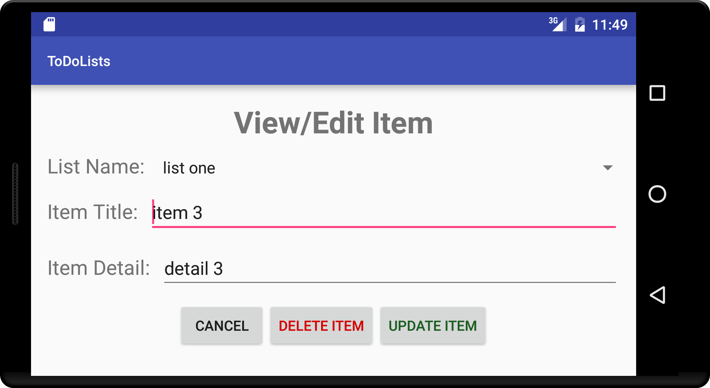

# Charlie's ToDo List App

This app allows the user to do the following:

* Create multiple todo lists
* View a list of all todo lists
* View each list in detail, showing the items that belong to that list
* Add items to each todo list
* Edit items - change title or detail strings, move item to a different list, or delete item
* Edit lists - change name or delete list

When the user creates or edits a list, they receive an error if they try to submit a blank list name. Similarly, if a user enters a list name that is already in use, they are notified that name cannot be used again.

When the user creates or edits an item, they receive an error if they try to submit a blank item title. Similarly, if a user enters an item title that is already in use in the specified list, they are notified that item title cannot be used again in that list.

The screenshots below demonstrate the app's user interface. Please see the "prototype" directory for photos of my original paper prototype.

---

**View Lists Activity - Home Screen**  
This activity shows the names of all the ToDo lists the user has created in a ListView. Clicking on a list name takes the user to the View List Detail activity for that list. Clicking the "Add List" button takes the user to the Add List activity.  

---

**Add List Activity**  
This activity allows the user to enter a name for a new list, and create it by clicking the "Create" button. If the user leaves the EditText blank, they receive an error message stating the list name cannot be blank. If the user enters a name that is already in use for another list, they receive a Toast saying that name is in use and they must pick another. Clicking the "Cancel" button returns the user to the View Lists activity.  

---

**View List Detail Activity**  
This activity shows a list of the item titles for the items contained by the ToDo list the user clicked on. If the user clicks on an item title, they are sent to the Edit Item activity for that item. If the user clicks the "Add Item" button they are sent to the Add Item activity, and the "Edit List" sends them to the Edit List activity. The user can use Android's back button to return to the View Lists activity (home screen).  

---

**Add Item Activity**  
This activity allows a user to enter title and detail strings for a new item. The spinner is pre-selected with the list the user was viewing when they clicked the "Add Item" button, but the user can select a different list if they desire, and the new item will be created in whatever list is specified in the spinner. Furthermore, after clicking "Create" the user will be returned to the View List Detail activity for whichever list the new item was added to (not necessarily the list they had been viewing previously). If the user leaves the item title blank they are given an error saying it cannot be blank. If the user enters an item title already used in the specified list, they get a Toast notifying them they must pick a different name. The "Cancel" button sends the user back to the View List Detail activity for the list they had been viewing, with no item added. There are two screenshots for this activity, as landscape mode required a modified layout in order for everything to fit on the screen.  

---

**Edit Item Activity**  
This activity allows the user to view an item's detail, as well as change the title or detail strings, or even move the item to a different list. The user can also delete the item entirely with the "Delete Item" button. If the user edits the item title to be blank, they receive an error message, and if they enter an item title already used in the list specified in the spinner, a Toast notifies them to pick a different title. Cancel returns to the View List Detail activity. This view also has two screenshots because it required a different layout for landscape mode to ensure all views fit on the screen.  

---

**Edit List Activity**  
This activity allows the user to change the name of a list. If they leave the name blank they get an error message, and if they enter a name already in use they get a Toast notifying them to pick a different name. "Cancel" returns to the View List Detail activity. The "Delete List" button will delete all items associated with the list and delete the list itself, and finally sends the user back to the home screen, the View Lists activity.  

